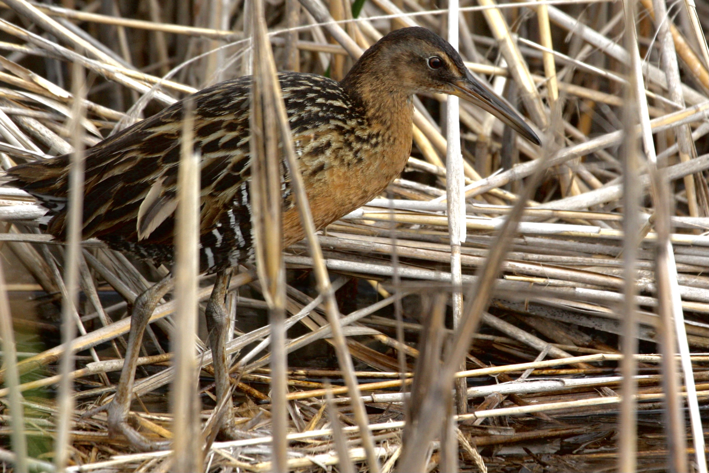

$${\color{green}\Huge {King \space Rail \space Population \space Comparison }}$$   

#### This repository contains files and information pertaining to whole genome data of four species (king rail, clapper rail, Virginia rail, and eastern bluebird). My research centers the king rail, and so the primary focus of this repository is the processing and analyzing of king rail whole genome data.
- - - -

### Aim
I am interested in comparing four geographically separate king rail populations to assess genetic diversity and gene flow. Time permitting, I am also interested in finding genes or genomic regions that affect migration traits (*e.g.*, migratory timing and direction).

***
### Repo Contents
- **analyses**: A collection of subdirectories containing analysis information
- **bin**: Bash shell and R scripts written by Carol Gause
  - **Average_Depth.sh**: A bash shell script to calculate average depth accross a genome.
  - **MapAndSort.sh**:  A bash shell script to map fastq files to a reference genome and sort the output bam file.
  - **bcftools.sh**: A bash shell script to create a VCF file containing variant calls from a BAM file.
  - **flagstat.sh**: A bash shell script to append the names of BAM files to a text file and executes samtools flagstat on each of them. It then adds the output to the same text file.
  - **PCAngsdPlot.R**: An R script to create a PCA plot from the covariance matrix output of PCANGSD.
  - **bcftools.sh**: A bash shell script to process sorted bam files using bcftools to generate VCF output files with appropriate prefixes.

- **results**: A collection of subdirectories containing outputs of pre-processing steps and analyses

***

### Contributor 
- [Carol Gause](http://www.balalab.com/people.html)   

---
### Funding Sources
Grant funding for this project was generously awarded by The Garden Club of America, The Carolina Bird Club, and The Association of Field Ornithologists.

---    
### Thank you  
Thank you to our collaborators who graciously provided us with samples:
- [Jessica Schmit, U.Ark.](https://www1.usgs.gov/coopunits/staff/2354999)
- [Dr. Dustin Brewer, U. Central Michigan](https://www.researchgate.net/profile/Dustin-Brewer-2)
- [Dr. Elisa Elizondo, U.Del.](https://www.researchgate.net/profile/Elisa-Elizondo)
- [Dr. Andrew Kratter, FL Museum of Natural Sciences](https://www.researchgate.net/profile/Andrew-Kratter)

---  
### Natural history & background
The  king rail is a very secretive, freshwater marsh bird. While it is chicken-sized, it is very hard to see due to the dense emergent vegetation it inhabits. As you might imagine, this makes these rails very difficult to study. For this reason, we don't know as much about king rails as we do about easier-to-study species. It is really important to study these birds as they are indicators of freshwater marsh ecosystem health. They are sensitive to environmental changes, and their [populations have been declining for over half a century](https://abcbirds.org/bird/king-rail/). The king rail is listed as [federally endangered in Canada](https://naturecanada.ca/discover-nature/endangered-species/king-rail/) and as [threatened or endangered by 12 states in the United States](https://birdsoftheworld.org/bow/species/kinrai4/cur/introduction#:~:text=Despite%20this%20broad%20geographic%20range,as%20well%20as%20in%20Canada.).  
 
In the United States, the distribution of the king rail has become concentrated along the east coast. This is a result of inland freshwater marshes vanishing [due to land-use changes and habitat degradation](https://portal.ct.gov/DEEP/Wildlife/Fact-Sheets/King-Rail). This has led to the remaining freshwater marshes in the southeast becoming the primary habitat for these birds. However, populations along the east coast face their own challenges: climate change has led to sea-level rise and increased occurrences of intense storms resulting in saltwater intrusion. This change in habitat conditions [renders these areas unsuitable for the king rail](https://www.allaboutbirds.org/guide/King_Rail/lifehistory#). The clapper rail, which is tolerant of saltwater, [often out-competes the king rail in brackish habitats](https://www.ncbi.nlm.nih.gov/pmc/articles/PMC6202719/). Additionally, the presence of the invasive plant *Phragmites australis* in both inland and coastal marshes further complicates the situation. King rails can tolerate this plant but have not been observed nesting in it.  

$${\color{red}For \space these \space reasons, \space it \space is \space becoming \space increasingly \space urgent \space to \space learn \space more \space about \space this \space species.}$$   

 ---
#### The king rail (*Rallus elegans*)

*Photo by Nicolas Main*
