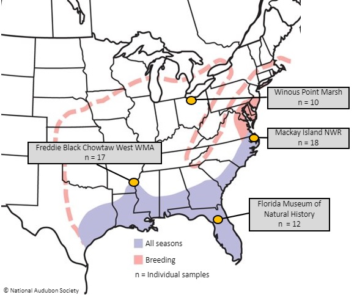

## Analyses
---
### Contents

- **ANGSD**: Markdown files with information about tests run.
- **VariantCalling**: A markdown file containing Bash shell commands for creating BCF files.
---
### King Rail Sample Populations
  
  
[*Range map created by the Audubon Society*](https://www.audubon.org/field-guide/bird/king-rail)     
Note: Sample numbers were constrained by funding and the number of king rails captured. King rails are difficult to capture [due to their secretive nature](https://www.pgc.pa.gov/Wildlife/EndangeredandThreatened/Pages/KingRail.aspx), and so we are very fortunate to have received the samples we did from our collaborators (listed below).

---    
### Collaborators 
Our collaborators who graciously provided samples are listed below:
- [Jessica Schmit, U.Ark.](https://www1.usgs.gov/coopunits/staff/2354999)
- [Dr. Dustin Brewer, U. Central Michigan](https://www.researchgate.net/profile/Dustin-Brewer-2)
- [Dr. Elisa Elizondo, U.Del.](https://www.researchgate.net/profile/Elisa-Elizondo)
- [Dr. Andrew Kratter, FL Museum of Natural Sciences](https://www.researchgate.net/profile/Andrew-Kratter)

